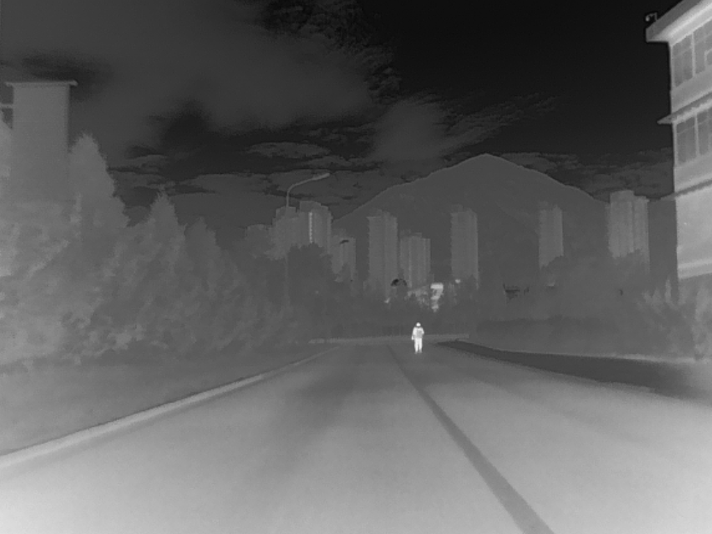
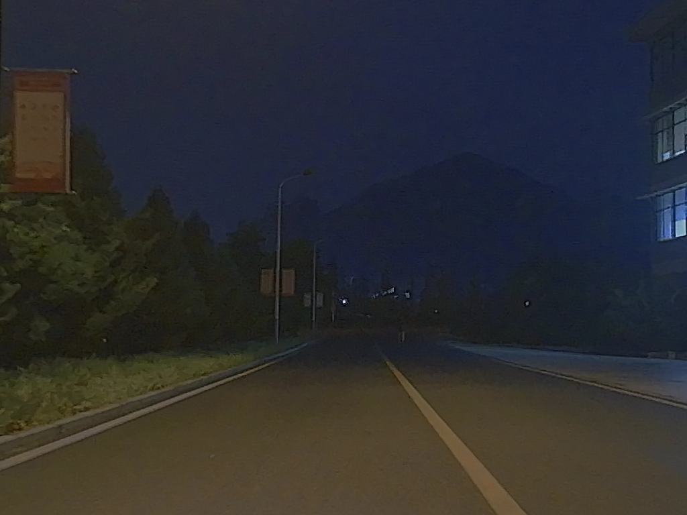
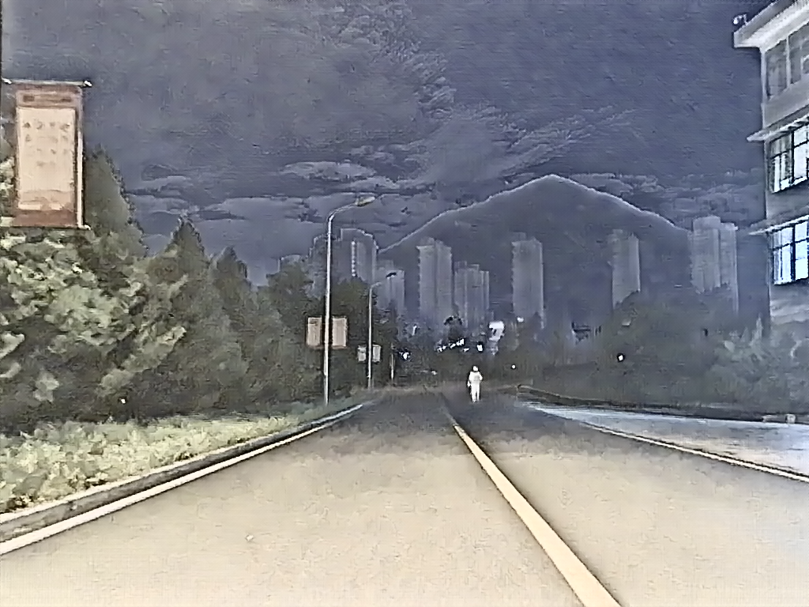
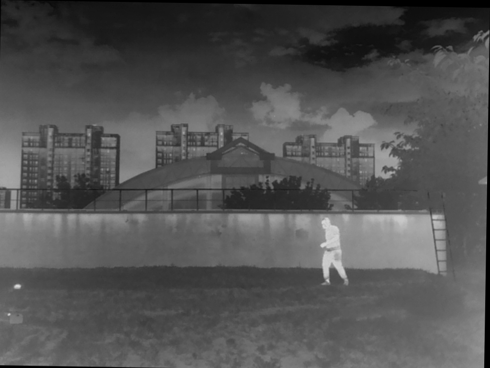
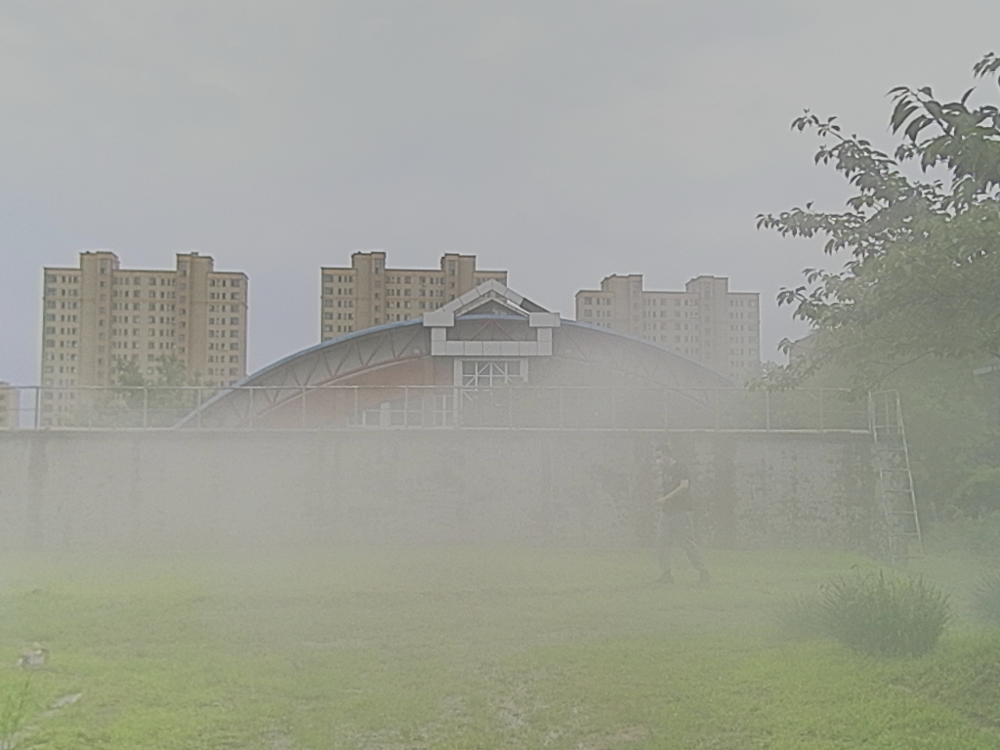
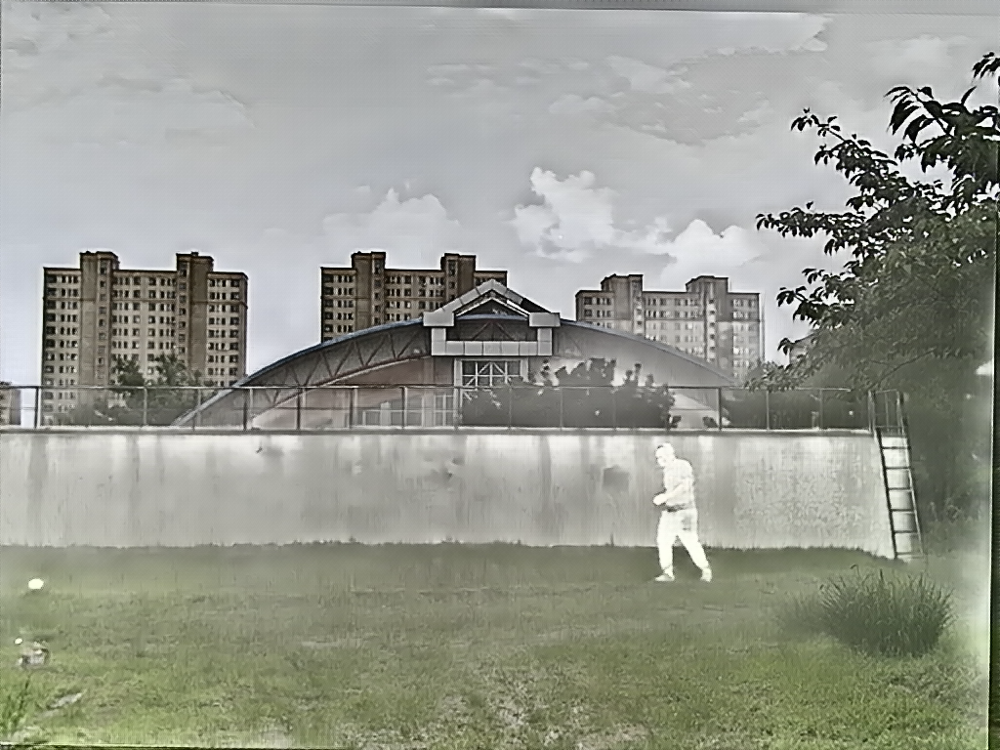

# AgentFuse
🔥 [ACM MM 2026] Official code for "Faster and Better: Reinforced Collaborative Distillation and Self-Learning for Infrared-Visible Image Fusion"

[Yuhao Wang](https://github.com/wyhlaowang/AutoFuse) ·
[Lingjuan Miao](https://github.com/wyhlaowang/AutoFuse) ·
[Zhiqiang Zhou](https://github.com/bitzhouzq) ·
[Yajun Qiao](https://github.com/QYJ123/) ·

# ⚙️ Installation
## Prerequisites
- Python 3.9 or higher
- PyTorch 1.8.2 or higher
- CUDA 11.1 or higher

## 1. Create a New Conda environment:

```
conda create -n AgentFuse python=3.10
conda deactivate
conda activate AgentFuse
```

## 2. Install PyTorch with CUDA support:
```
pip install torch==1.13.1+cu116 torchvision==0.14.1+cu116 torchaudio==0.13.1 --extra-index-url https://download.pytorch.org/whl/cu116
```
(Recommended: CUDA 11.6 and Torch 1.13.1)

## 3. Clone the repository and install the package:
```
https://github.com/wyhlaowang/AgentFuse

pip install -r requirements.txt
```

# 🚀 Getting Started

## ❄️ Inference

1. Please put test data into the ```test_imgs``` directory 

(infrared images in ```ir``` subfolder, visible images in ```vi``` subfolder)

2. run ```python src/test.py```

The fused results will be saved in the ```./results/``` folder. 

## 🎬 Demo
[▶ 查看演示视频](./results/fusion_video.mp4)

From left to right are the infrared image, visible image, and fused image.

<div style="display: flex; gap: 10px;">
  
  
  
</div>

---

<div style="display: flex; gap: 10px;">
  
  
  
</div>


